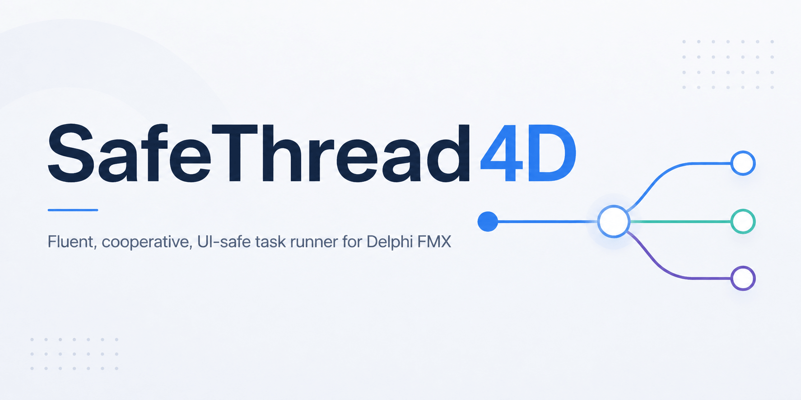
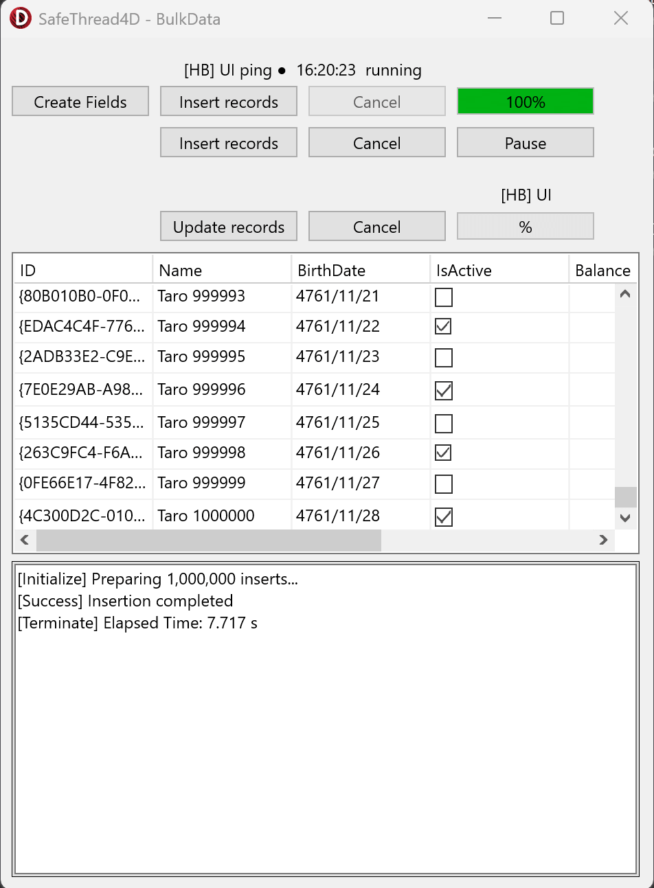
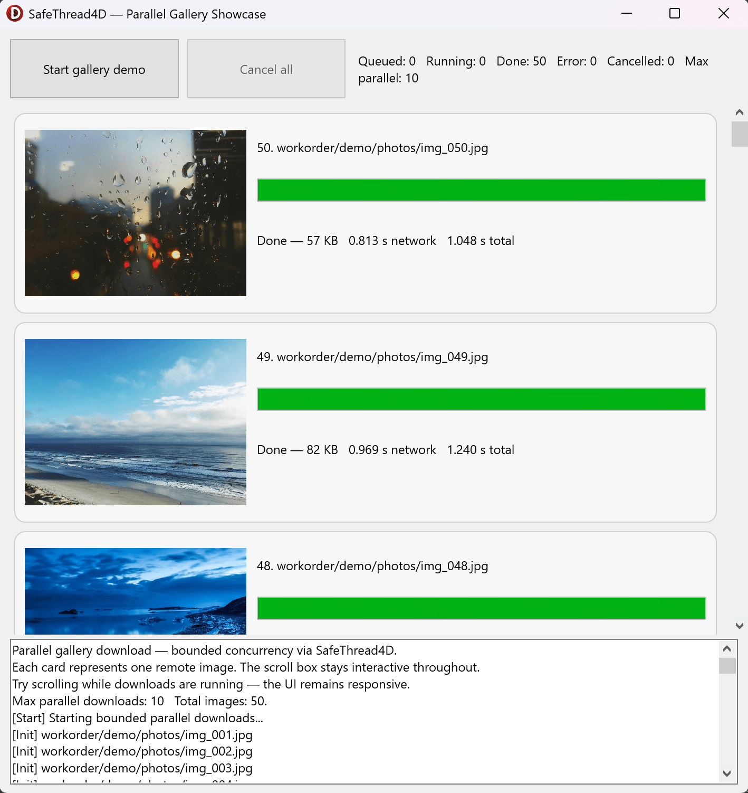
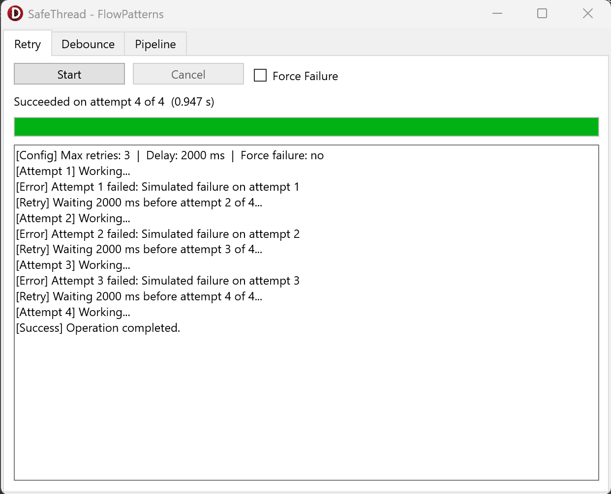
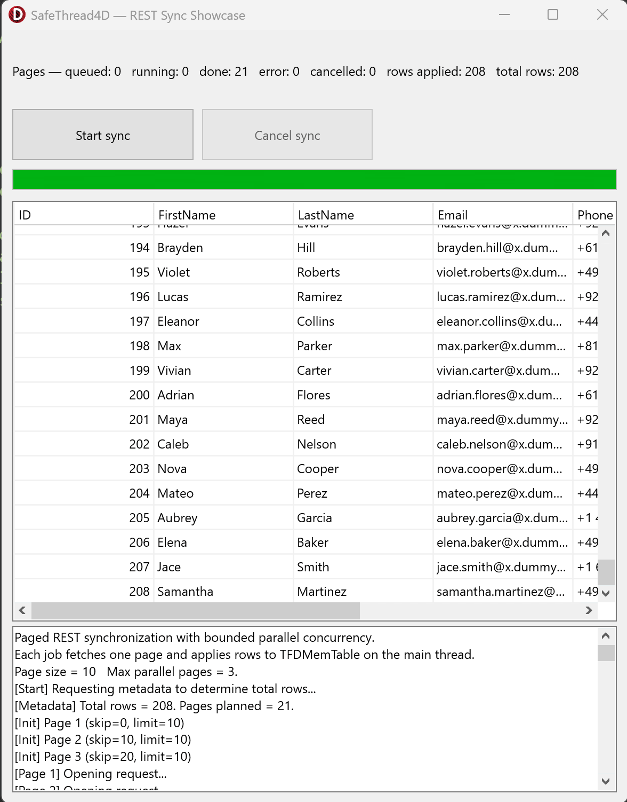

<p align="center">
  
</p>

# SafeThread4D

**Fluent, cooperative, UI-safe task runner for Delphi FMX — structured background execution with predictable lifecycle callbacks and first-class mobile awareness.**

[](LICENSE)
[](https://www.embarcadero.com/products/delphi)

**SafeThread4D** is a task runner built around a single idea: **asynchronous work should be explicit, traceable, and deterministic**. It takes the recurring ceremony of background threading in Delphi — `TThread.Synchronize`, `TThread.Queue`, cooperative cancellation, progress throttling, UI marshaling — and expresses it through a fluent, predictable lifecycle.

Every callback runs on a known thread. Every operation can participate in cooperative cancellation. Every progress update is rate-limited. The library itself never calls `Application.ProcessMessages` internally.

---

## Why this project exists

Delphi ships with several ways to run background work — `TThread`, `TTask`/`ITask`, `TParallel`. Each solves part of the problem. None of them solve all of it at once, and none of them are shaped around the concerns of FMX applications running on mobile devices.

Real applications need more than "run this on another thread". They need a predictable place to initialize UI state, a clean way to report progress without flooding the main-thread queue, a cancellation model that does not corrupt state, a timeout that can be observed from user code, and mobile-aware liveness/progress diagnostics for long-running tasks.

**SafeThread4D** is designed around those concerns. The lifecycle is explicit. The cancellation is cooperative. The progress is throttled. The optional heartbeat provides a lightweight liveness/progress pulse while long-running work remains outside the UI thread. The coordination between UI and worker is the same in every task — no ad-hoc `Synchronize` blocks scattered across the codebase.

The library is intentionally focused: **structured background execution with explicit lifecycle**. It does not try to be a general concurrency framework, a thread pool, or a task composition engine. It provides one solid, predictable runner, and stops there.

As future directions, the project may evolve toward **task composition** (serial chains, parallel fork/join) and **retry policies**. Those are not the goal of this first stage.

---

## Table of contents

- [Quick overview](#quick-overview)
- [Design philosophy](#design-philosophy)
- [The shape teaches the habit](#the-shape-teaches-the-habit)
- [When to use SafeThread4D](#when-to-use-safethread4d)
- [Requirements](#requirements)
- [Installation](#installation)
- [Documentation](#documentation)
- [Quick start](#quick-start)
- [Features](#features)
- [Thread lifecycle](#thread-lifecycle)
- [Cooperative model](#cooperative-model)
- [Progress reporting](#progress-reporting)
- [Mobile UI liveness diagnostics](#mobile-ui-liveness-diagnostics)
- [Lifecycle coordination](#lifecycle-coordination)
- [Weak + Strong startup pattern](#weak--strong-startup-pattern)
- [Architecture](#architecture)
- [Repository layout](#repository-layout)
- [Demo applications](#demo-applications)
- [Screenshots](#screenshots)
- [Testing](#testing)
- [Design decisions](#design-decisions)
- [Scope and limitations](#scope-and-limitations)
- [Versioning](#versioning)
- [License](#license)

---

## Quick overview

**Minimal cooperative task**

```delphi
TSafeThread4D.StartThread(
  TSafeThread4DParams.New
    .SetOnExecute(procedure(Ctx: TThreadContext)
      begin
        // runs on the worker thread
        DoHeavyWork;
      end)
    .SetOnSuccess(procedure(Ctx: TThreadContext)
      begin
        // runs on the UI thread
        ShowMessage('Done');
      end)
);
```

**Task with progress, cancellation, and timeout**

```delphi
var
  StrongRef: ISafeThread4DParams;
  WeakRef: Pointer;
begin
  TSafeThread4D.StartThreadWithWeakRef(
    TSafeThread4DParams.New
      .SetThreadName('process-batch')
      .SetTimeoutMs(30000)
      .SetOnExecute(procedure(Ctx: TThreadContext)
        var
          I: Integer;
          P: ISafeThread4DParams;
        begin
          P := ISafeThread4DParams(IInterface(WeakRef));

          for I := 1 to 100 do
          begin
            TSafeThread4D.CheckCancel(P, Ctx);
            TSafeThread4D.CheckTimeout(P, Ctx);
            TSafeThread4D.ReportProgress(P, I / 100);
            ProcessItem(I);
          end;
        end)
      .SetOnProgress(procedure(Pct: Single)
        begin
          ProgressBar1.Value := Pct * 100;
        end)
      .SetOnSuccess(procedure(Ctx: TThreadContext)
        begin
          ShowMessage(Format('Finished in %d ms', [Ctx.ElapsedMilliseconds]));
        end)
      .SetOnTimeout(procedure(Ctx: TThreadContext)
        begin
          ShowMessage('Operation timed out.');
        end),
    WeakRef,
    StrongRef
  );
end;
```

All UI lifecycle callbacks marshal to the main thread automatically. User code inside `OnExecute` should not touch visual controls directly.

---

## Design philosophy

SafeThread4D is built on four principles:

**1. Explicit over implicit.**
Every callback has a documented thread context. There is no guessing about whether `OnSuccess` runs on the worker or the UI — it runs on the UI, always.

**2. Cooperative over preemptive.**
Cancellation and timeout only fire when your worker code explicitly checks for them with `CheckCancel` and `CheckTimeout`. This keeps application state coherent. There is no thread-killing, no forced unwinding, no half-committed transactions.

**3. Throttled over flooding.**
Progress updates are rate-limited to protect the main-thread message queue, with a first-pulse bypass so the UI responds immediately to the first update.

**4. Observable over opaque.**
Thread names appear in the IDE. Elapsed time is measured automatically. Logical thread IDs correlate tasks across logs. A heartbeat thread can make mobile UI liveness observable during long-running tasks, provided the main thread remains free to process queued callbacks.

---

## The shape teaches the habit

There is a common antipattern in Delphi code where a background thread is spawned only to marshal a handful of UI updates back to the main thread:

```delphi
// Antipattern: a thread that does no real background work
TThread.CreateAnonymousThread(
  procedure
  begin
    TThread.Synchronize(nil,
      procedure
      begin
        Label1.Text := 'Processing...';
        ProgressBar1.Value := 50;
      end);
  end).Start;
```

No CPU-bound computation. No I/O. No blocking call. The worker exists only to dispatch UI updates through `Synchronize`. The result is a thread creation cost, an extra round-trip through the main-thread message queue, and the illusion of parallelism where none exists. The code would run faster — and be easier to reason about — if those three lines ran directly on the main thread.

The antipattern usually comes from two misconceptions: that using threads automatically makes code "faster" or "more professional", and that responsiveness and concurrency are the same thing. They are not. A UI only blocks when real work blocks it. If there is no real work, there is no need for a thread.

SafeThread4D's API makes this distinction visible by design. The worker body is named `OnExecute` and is separate from the UI callbacks. If a developer finds that `OnExecute` would be empty — or would only touch UI — the API is signaling that a background task is not the right tool for that problem. The answer is to run the code directly on the main thread.

This is not enforcement. It is shape. The structure of the API makes the correct decision natural and the incorrect one visibly strange. Over time, it helps developers internalize where a background thread is actually worth using, and where it is only noise.

---

## When to use SafeThread4D

| Scenario | Recommended approach |
|---|---|
| Long-running work in a desktop or mobile FMX application | **SafeThread4D** |
| Background operation that reports progress to a UI | **SafeThread4D** |
| Mobile task that needs periodic progress/liveness diagnostics | **SafeThread4D** (optional heartbeat) |
| Work that must be cancellable cleanly from the UI | **SafeThread4D** |
| Operation with a hard time limit | **SafeThread4D** (timeout) |
| CPU-bound fire-and-forget with no UI interaction | `TTask` or plain `TThread` |
| Pure parallel computation over a collection (no UI interaction) | `TParallel.For` (with care for cancellation and error handling) |
| Simple one-off `TThread.Synchronize` call | Standard RTL |
| UI update that does no real background work | No thread — run directly on the main thread |

SafeThread4D shines when the task has a UI on the other end and a user watching the screen. For pure compute without UI interaction, the built-in PPL may be a lighter fit. And when there is no blocking work at all, no threading library is the right answer.

---

## Requirements

- **Delphi 11** or later.
- No external dependencies.

The project was developed and validated on Delphi 11+. Earlier versions (10.3 Rio and later) may work because the library only requires generic `TInterlocked` support, but they are not officially validated for this initial release.

### Platforms

Validated target scenarios for this first release are Delphi FMX applications on:

- Windows
- macOS
- iOS
- Android

The core implementation itself is RTL-based and does not depend on FMX-specific types, so non-FMX usage may also be possible in projects with the same single-UI-thread model, but that is not the primary validated target of this release.

### Framework

The primary target is **FMX**, but the core model is framework-agnostic. The library does not depend on any FMX-specific type and can technically be used with VCL. The only requirement is a single UI thread (the main thread), as in both FMX and VCL.

---

## Installation

Clone the repository and add the `src` folder to your project's **Search Path**:

**Project → Options → Building → Delphi Compiler → Search Path**

Then import the unit:

```delphi
uses
  SafeThread4D;
```

SafeThread4D uses only RTL units such as `System.Classes`, `System.Diagnostics`, `System.SysUtils`, and `System.SyncObjs`.

---

## Documentation

Additional project documentation is available here:

- [Architecture reference](docs/Architecture.md) — deep dive into the execution machine, state transitions, and the termination model
- [Conceptual guide (English)](docs/Guide_en.md) — from the real problem to the mechanism
- [Conceptual guide (Portuguese)](docs/Guide_pt-BR.md) — do problema real ao mecanismo
- [Shutdown drain note](docs/ShutdownDrain.md) — why `CheckSynchronize(...)` is the correct drain mechanism for shutdown loops in FMX

---

## Quick start

### Minimal task

```delphi
TSafeThread4D.StartThread(
  TSafeThread4DParams.New
    .SetOnExecute(procedure(Ctx: TThreadContext)
      begin
        // CPU-bound work simulated with Sleep — runs on the worker thread
        Sleep(2000);
      end)
    .SetOnSuccess(procedure(Ctx: TThreadContext)
      begin
        ShowMessage('Done');
      end)
);
```

### Task with progress and cancel button

```delphi
// in the form's private section:
private
  FRunningTask: ISafeThread4DParams;

procedure TFormMain.ButtonStartClick(Sender: TObject);
var
  Params: ISafeThread4DParams;
  WeakRef: Pointer;
begin
  Params := TSafeThread4DParams.New
    .SetThreadName('heavy-calc')

    .SetOnExecute(procedure(Ctx: TThreadContext)
      var
        I: Integer;
        P: ISafeThread4DParams;
      begin
        P := ISafeThread4DParams(IInterface(WeakRef));

        for I := 1 to 100 do
        begin
          TSafeThread4D.CheckCancel(P, Ctx);
          TSafeThread4D.ReportProgress(P, I / 100);
          // Simulated per-iteration work — runs on the worker thread
          Sleep(50);
        end;
      end)

    .SetOnProgress(procedure(Pct: Single)
      begin
        ProgressBar1.Value := Pct * 100;
      end)

    .SetOnSuccess(procedure(Ctx: TThreadContext)
      begin
        ShowMessage(Format('Done in %d ms', [Ctx.ElapsedMilliseconds]));
      end)

    .SetOnCancel(procedure(Ctx: TThreadContext)
      begin
        ShowMessage('Cancelled by user.');
      end);

  TSafeThread4D.StartThreadWithWeakRef(Params, WeakRef, FRunningTask);
end;

procedure TFormMain.ButtonCancelClick(Sender: TObject);
begin
  if Assigned(FRunningTask) then
    TSafeThread4D.Cancel(FRunningTask);
end;
```

### Task with optional mobile heartbeat

```delphi
TSafeThread4D.StartThread(
  TSafeThread4DParams.New
    .SetOnExecute(procedure(Ctx: TThreadContext)
      begin
        LongMobileOperation;
      end)
    .SetHeartbeatIntervalMs(1000)
    .SetOnHeartbeat(procedure
      begin
        // lightweight UI liveness/progress ping;
        // runs only if the main thread is free to process queued callbacks
      end)
    .SetOnSuccess(procedure(Ctx: TThreadContext)
      begin
        UpdateResultsView;
      end)
);
```

---

## Features

| Feature | Supported |
|---|---|
| Fluent builder API | ✓ |
| Lifecycle callbacks on the main thread | ✓ |
| Worker body on a background thread | ✓ |
| Cooperative cancellation (`CheckCancel`) | ✓ |
| Cooperative timeout (`CheckTimeout`) | ✓ |
| Throttled progress with first-pulse bypass | ✓ |
| Guaranteed 100% progress before `OnSuccess`/`OnComplete` | ✓ |
| `OnError` ordered deterministically via `Synchronize` | ✓ |
| Optional heartbeat for mobile UI liveness/progress diagnostics | ✓ |
| Weak + Strong startup pattern helper | ✓ |
| Thread naming for debugging | ✓ |
| Logical thread IDs | ✓ |
| Elapsed-time measurement | ✓ |
| Atomic state access across threads | ✓ |
| Rejection of concurrent reuse of the same params | ✓ |
| Safe waiting independent of `TThread.FreeOnTerminate` | ✓ |
| Main-thread guard on blocking calls | ✓ |
| Runs without any external dependency | ✓ |

---

## Thread lifecycle

All UI callbacks execute on the **main thread**. All long-running work executes on a **background thread**.

### Primary lifecycle callbacks

| Phase | Thread | Fires when |
|---|---|---|
| `OnInitialize` | UI | Once, before work starts (skipped if already cancelled) |
| `OnExecute` | Worker | Main work — **required** |
| `OnProgress` | UI | Throttled during work; forced to 100% before `OnSuccess`/`OnComplete` |
| `OnSuccess` | UI | Worker finished without error or cancellation |
| `OnError` | UI | Worker raised a non-cancellation, non-timeout exception |
| `OnTimeout` | UI | `EOperationTimeout` was raised (via `CheckTimeout`) |
| `OnCancel` | UI | Cancellation was observed (via `CheckCancel` or external flag) |
| `OnComplete` | UI | After successful completion, or after error only if `CompleteWithError = True` |
| `OnTerminate` | UI | Final lifecycle callback in the structured SafeThread4D flow |

### Secondary `TNotifyEvent` hooks

For cases where a classic `TNotifyEvent` signature is preferable to the structured `TThreadContext`-based callbacks, two additional hooks are available:

| Phase | Thread | Fires when |
|---|---|---|
| `OnInitializeEvent` | UI | Same point as `OnInitialize`, but receives a `TNotifyEvent` instead of `TThreadContext` |
| `OnTerminateEvent` | UI | Forwarded by the termination proxy after `TThread.OnTerminate` fires |

These hooks are part of the same lifecycle. See the [Architecture document](docs/Architecture.md) for how `OnTerminate` and `OnTerminateEvent` are sequenced relative to the worker finally block and the termination proxy.

This separation eliminates the common "some callbacks run here, some there" ambiguity that affects ad-hoc threading code.

`OnComplete` does not fire on cancellation and does not fire on timeout in the current version.

---

## Cooperative model

SafeThread4D is deliberately cooperative, not preemptive:

- Cancellation only happens when worker code **calls `CheckCancel`**
- Timeout only happens when worker code **calls `CheckTimeout`**
- UI work must stay inside UI callbacks — worker code should not touch visual components directly

```delphi
// from the UI:
TSafeThread4D.Cancel(FRunningTask);

// inside OnExecute, assuming P was recovered from WeakRef:
for Item in BigDataset do
begin
  TSafeThread4D.CheckCancel(P, Ctx); // raises EOperationCancelled
  ProcessItem(Item);
end;
```

The library catches `EOperationCancelled` internally, skips `OnSuccess` and `OnComplete`, fires `OnCancel` on the UI thread, and finally runs `OnTerminate`. `EOperationTimeout` behaves analogously, firing `OnTimeout` instead of `OnCancel`.

This model keeps application state coherent. There is no thread-killing, no half-finished transactions, no UI in an undefined state.

---

## Progress reporting

Progress is delivered through a throttle that protects the main-thread message queue:

```delphi
.SetOnProgress(procedure(P: Single)
  begin
    ProgressBar1.Value := P * 100;
  end)
.SetProgressIntervalMs(100)  // default
```

Three rules govern delivery:

1. The **first** update always reaches the UI immediately, regardless of the interval.
2. Subsequent updates are rate-limited to at most one per `ProgressIntervalMs`.
3. A **final 100%** pulse is forcibly delivered before `OnSuccess` and `OnComplete`, so the UI never finishes below completion just because the last throttled update was skipped.

In normal worker-thread usage, each task maintains its own progress cadence.

---

## Mobile UI liveness diagnostics

In this context, ANR is avoided by keeping the main thread free to process input, rendering, lifecycle messages, and system callbacks. A heartbeat cannot prevent ANR if the main thread is blocked: queued callbacks only run when the main thread is able to process them.

SafeThread4D therefore treats heartbeat as a more limited tool: an optional lightweight UI liveness/progress pulse for long-running mobile tasks where the real work is already outside the UI thread.

```delphi
TSafeThread4DParams.New
  .SetOnExecute(procedure(Ctx: TThreadContext) ...)
  .SetHeartbeatIntervalMs(1000)
  .SetOnHeartbeat(procedure
    begin
      // optional liveness/progress ping;
      // keep this callback short
    end);
```

The heartbeat automatically stops when the worker finishes. Pings that arrive after termination self-abort safely. It does not replace correct threading discipline: long-running work must stay off the UI thread, blocking waits on the UI thread must be avoided, and synchronized callbacks must remain short.

---


## Lifecycle coordination

For starting, stopping, and waiting, the **params-based helpers** are the supported path:

```delphi
Params.IsRunning                         // atomic state snapshot
TSafeThread4D.IsThreadRunning(Params)    // same, as a class method
TSafeThread4D.Cancel(Params)             // cooperative cancel request
TSafeThread4D.CancelAndWait(Params)      // cancel and block until fully terminated
```

`CancelAndWait` signals cancellation and blocks on an internal completion event until the task reaches its `PublishedComplete` state — all callbacks have fired and termination cleanup is complete. It is safe to call with `FreeOnTerminate = True` (the default), because the completion event belongs to the params object, not to the thread.

Raw `TThread` handle helpers (`WaitFor(Thread)`, `IsThreadRunning(Thread)`) are **intentionally disabled**. A raw thread handle cannot be safely validated once the thread is free to self-destruct, and the library will raise an exception if either is called.

> Calling `CancelAndWait` from the main thread is rejected with an exception, because blocking the main thread while UI callbacks are pending would deadlock.

A single params instance represents a single running operation and **must not be started concurrently**. Attempting to reuse a running params instance raises an exception at `StartThread`.

---

## Weak + Strong startup pattern

Captured anonymous methods can easily create retain cycles when an `ISafeThread4DParams` reference is captured by one of its own callbacks.

SafeThread4D provides a helper for the canonical weak + strong startup pattern: the caller keeps a strong interface reference (used to cancel or observe the task from the UI), and may optionally hold a weak pointer for use inside callbacks that need to refer back to the params object without creating a retain cycle.

The helper does not automatically rewrite captured closures. If your callback needs to refer back to the params object, use the overload that exposes `WeakRef` and recover the interface carefully when needed, or avoid capturing the params object directly.

```delphi
var
  Params: ISafeThread4DParams;
  StrongRef: ISafeThread4DParams;
  WeakRef: Pointer;
begin
  Params := TSafeThread4DParams.New
    .SetOnExecute(procedure(Ctx: TThreadContext)
      begin
        DoHeavyWork;
      end)
    .SetOnSuccess(procedure(Ctx: TThreadContext)
      begin
        ShowMessage('Done');
      end);

  TSafeThread4D.StartThreadWithWeakRef(Params, WeakRef, StrongRef);
end;
```

In the simpler overload, the caller keeps only the strong reference:

```delphi
TSafeThread4D.StartThreadWithWeakRef(Params, FRunningTask);
```

Use the `WeakRef` overload only when you truly need that pattern inside callback code.

---

## Architecture

The project is organized around a single cohesive unit:

```text
SafeThread4D
  ISafeThread4DParams       — fluent interface for configuration
  TSafeThread4DParams       — concrete builder and state holder
  TSafeThread4D             — static facade with StartThread and helpers
  TThreadContext            — immutable snapshot passed to callbacks
  EOperationCancelled       — exception raised by CheckCancel
  EOperationTimeout         — exception raised by CheckTimeout
```

Internally, the runtime coordinates five explicit roles:

- the **Caller** — form, view model, or other owner that configures and starts the task
- the **Params object** — holds configuration, atomic runtime state, thread handle, and the completion event
- the **worker thread** — runs the user's `OnExecute` body and dispatches lifecycle callbacks to the UI
- the **heartbeat thread** — optional, pings the UI on a fixed interval while the worker is active
- the **termination proxy** — chains termination cleanup, clears state atomically, and signals the completion event

State is shared through atomic integer flags (`TInterlocked`) and a single completion `TEvent`. No critical sections, no mutexes, no custom locking primitives.

For the full architectural breakdown — including state transitions, the two-flag runtime model, startup failure handling, and heartbeat shutdown paths — see the [Architecture document](docs/Architecture.md).

---

## Repository layout

```text
SafeThread4D/
├── .gitignore
├── LICENSE
├── README.md
│
├── assets/
│   ├── banner.png
│   └── screenshots/
│       ├── bulk-data.png
│       ├── flow-patterns.png
│       ├── parallel-gallery.png
│       └── rest-sync.png
│
├── docs/
│   ├── Architecture.md
│   ├── Guide_en.md
│   ├── Guide_pt-BR.md
│   └── ShutdownDrain.md
│
├── examples/
│   ├── BulkData/
│   ├── Concurrency/
│   ├── Download/
│   ├── FileOps/
│   ├── FlowPatterns/
│   ├── ParallelGallery/
│   └── RestSync/
│
├── src/
│   └── SafeThread4D.pas
│
└── tests/
    ├── project/
    │   ├── SafeThread4D.Tests.dpr
    │   └── SafeThread4D.Tests.dproj
    └── src/
        ├── SafeThread4D.Tests.CancelTimeout.pas
        ├── SafeThread4D.Tests.ErrorSemantics.pas
        ├── SafeThread4D.Tests.Guards.pas
        ├── SafeThread4D.Tests.Heartbeat.pas
        ├── SafeThread4D.Tests.Helpers.pas
        ├── SafeThread4D.Tests.Lifecycle.pas
        ├── SafeThread4D.Tests.Params.pas
        ├── SafeThread4D.Tests.Progress.pas
        ├── SafeThread4D.Tests.ReuseAndCompletion.pas
        └── SafeThread4D.Tests.Support.pas
```

---

## Demo applications

The `examples/` folder contains self-contained FMX applications that demonstrate typical integration patterns:

- **BulkData** — bulk data operation with cooperative cancellation, timeout, and throttled progress reporting over a large workload
- **Concurrency** — multiple parallel tasks with individual progress indicators and independent cancel controls
- **Download** — HTTP download with throttled progress reporting, cancellable execution, and clean error handling
- **FileOps** — file operations (copy, move, delete) with cooperative cancellation and hard timeout
- **FlowPatterns** — lifecycle flow demonstration covering success, error, cancel, timeout, and complete paths
- **ParallelGallery** — runtime-generated gallery showing multiple concurrent tasks coordinating with the UI
- **RestSync** — REST API synchronization with optional heartbeat for mobile liveness/progress diagnostics

Each demo is intended both as a manual validation tool and as a practical reference for common usage scenarios.

---

## Screenshots

### BulkData — large dataset operations under cooperative control



A bulk insert of 1 million records into a `TFDMemTable`, with throttled 
progress reporting, cooperative cancellation, and pause/resume support 
through worker-private snapshot handoff.

### ParallelGallery — concurrent image loading with adaptive UI



Bounded parallel downloads built on top of the SafeThread4D runtime, with 
real HTTP transfer progress and adaptive layout — the UI is built entirely 
at runtime and stays responsive while the network does the work.

### FlowPatterns — retry, debounce, and pipeline



Application-level flow patterns built on top of the SafeThread4D runtime: 
cooperative retry with delay, debounced input, and a three-step pipeline 
chained through `OnSuccess`.

### RestSync — REST API synchronization with mobile awareness



Multi-page REST API synchronization with cooperative cancel, throttled 
progress, and an active heartbeat — useful on mobile as a lightweight 
liveness/progress diagnostic while the real work remains off the UI thread.

---

## Testing

SafeThread4D includes a comprehensive test suite covering the full behavior surface of the mechanism:

- **Lifecycle** — callback ordering and thread context guarantees
- **CancelTimeout** — cooperative cancellation and timeout semantics
- **ErrorSemantics** — exception handling, `CompleteWithError`, and error propagation
- **Guards** — main-thread guards, raw `TThread` helper rejection, and reuse rejection
- **Heartbeat** — heartbeat lifecycle, shutdown ordering, and zombie ping prevention
- **Params** — builder fluency, parameter validation, and default values
- **Progress** — throttling, first-pulse bypass, and guaranteed final 100%
- **ReuseAndCompletion** — params reuse after completion and completion event semantics

The tests are located in `tests/` and can be run with Delphi's unit test runner (DUnitX). The suite acts as both a regression safety net and living documentation of the mechanism's contract.

---

## Design decisions

### Why cooperative cancellation?

Because preemptive thread termination corrupts state. A thread that is killed in the middle of a transaction, a file write, or a heap allocation leaves the application in an undefined condition. Cooperative cancellation trades a little developer responsibility (call `CheckCancel` at reasonable points) for state coherence.

### Why throttled progress?

Because a tight loop calling `TThread.Queue` on every iteration can flood the main-thread queue faster than the UI can drain it. The throttle enforces a healthy upper bound while the first-pulse bypass ensures the UI responds immediately to new work.

### Why a heartbeat thread for mobile UI liveness?

Because long-running mobile tasks often need observable progress or liveness feedback while work is running outside the UI thread. The heartbeat is not an ANR-prevention mechanism by itself; it is a lightweight diagnostic/progress helper that only runs when the main thread remains free to process queued callbacks.

### Why intentionally disable the raw `TThread` helpers?

Because `FreeOnTerminate = True` is the default, and a raw thread handle can become a dangling pointer at any moment. Hiding unsafe APIs is better than documenting them and hoping they will not be used.

### Why reject reuse of a running params instance?

Because the params object carries runtime state (cancel flag, completion event, thread handle). Starting it twice concurrently would produce silent cross-task corruption. Rejecting the reuse makes the contract obvious.

### Why a Weak + Strong startup helper?

Because the fluent API makes it natural to capture `Params` inside its own callbacks, which can create a retain cycle. The helper makes the intended ownership model explicit and provides the weak-reference variant when that pattern is really needed.

### Why no `Application.ProcessMessages`?

Because re-entering the UI event loop from inside framework code is a category of bugs that is extremely hard to diagnose. Marshaling is done exclusively through `TThread.Synchronize` and `TThread.Queue`, which have well-defined semantics.

---

## Scope and limitations

This version of **SafeThread4D** is focused on:

- structured background execution of a single task;
- explicit lifecycle callbacks on well-defined threads;
- cooperative cancellation and timeout;
- throttled progress reporting;
- mobile UI liveness/progress diagnostics through an optional heartbeat;
- safe coordination and termination.

At this stage, it is **not** intended to:

- provide task composition (serial chains, parallel fork/join);
- implement a thread pool;
- offer built-in retry with backoff;
- integrate with `ITask`/`TTask` as a first-class adapter;
- replace the full set of Delphi concurrency primitives.

That scope boundary is intentional. Composition, pooling, and retry are natural future directions, but this first stage is deliberately focused on getting the single-task runner right.

---

## Versioning

The project follows [Semantic Versioning](https://semver.org/).

---

## License

MIT License — see [LICENSE](LICENSE).

Copyright (c) 2026 Eduardo P. Araujo
