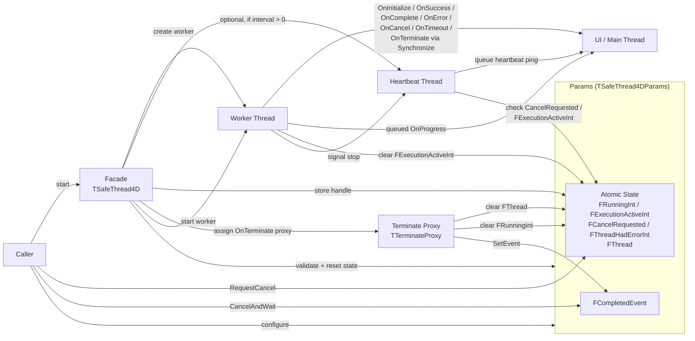
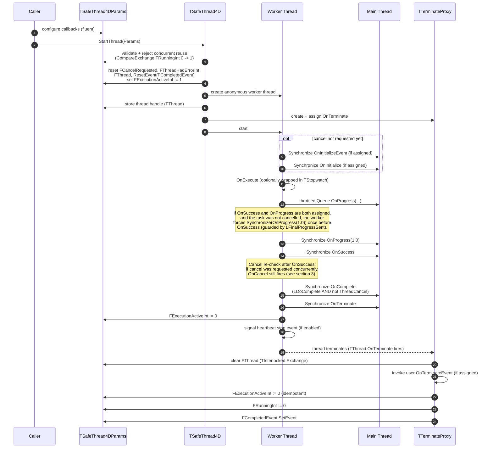
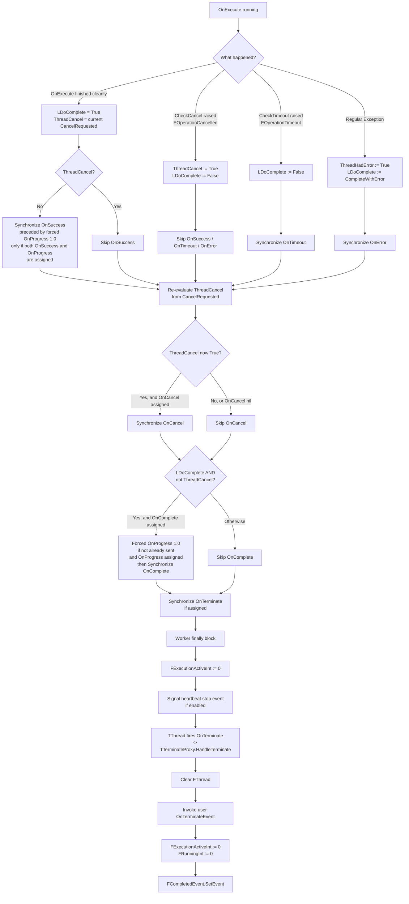
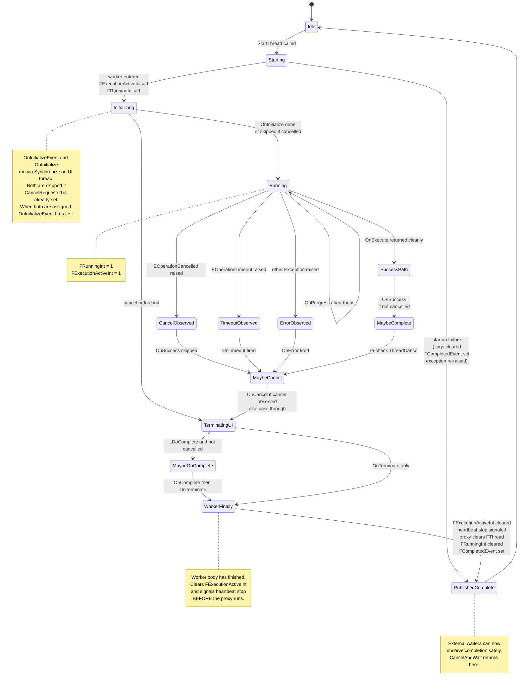
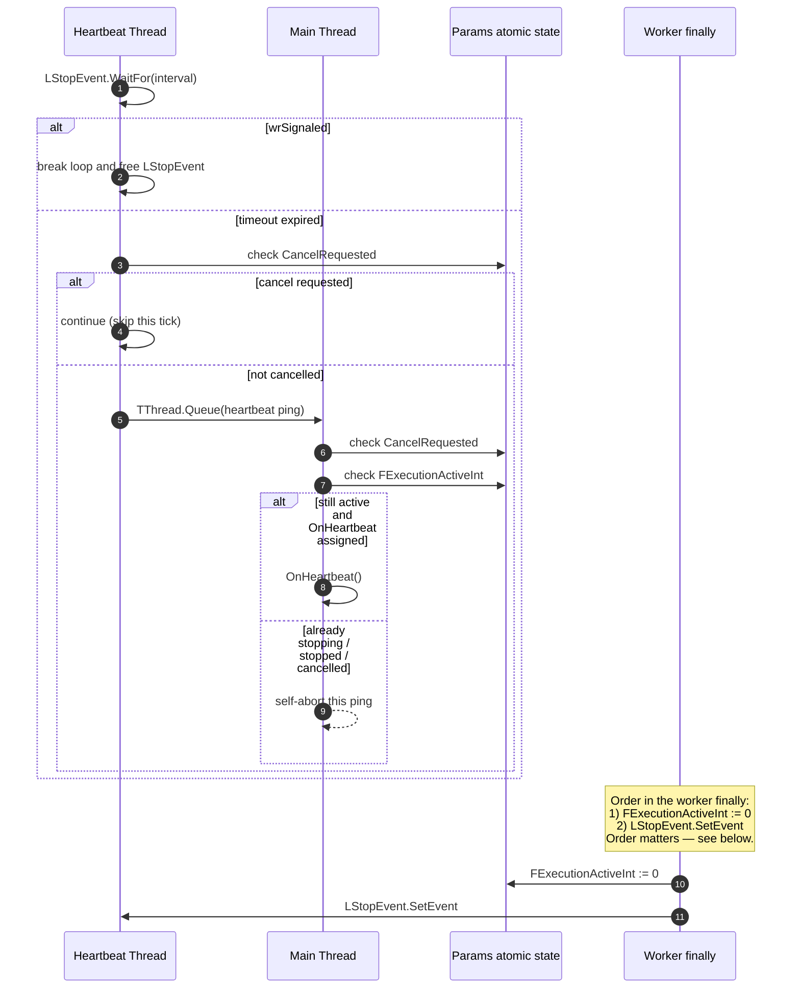

# SafeThread4D Architecture

**Version:** 1.0.0

SafeThread4D is not just a list of callbacks. It is a small execution machine with explicit roles, state transitions, and publication rules.

This document complements the README by showing the mechanism as a whole: who owns what, which thread executes each step, how cancellation and timeout are observed, and when completion is considered safely published.

---

## 1. Architectural map

### Reading the map

- **Caller**: form, view model, or other owner that configures and starts the task.
- **Params**: `TSafeThread4DParams`, holding configuration, atomic runtime state, the runtime thread handle, and the internal `FCompletedEvent` used for safe waiting.
- **Facade**: `TSafeThread4D`, the orchestration entrypoint (`StartThread`, `ExecuteThread`, `CancelAndWait`, etc.).
- **Worker**: background thread that runs `OnExecute`. UI lifecycle callbacks are dispatched through `TThread.Synchronize`, while progress is dispatched through `TThread.Queue`.
- **Heartbeat**: optional helper thread for UI pulse / ANR awareness, only created when `HeartbeatIntervalMs > 0`.
- **UI / Main Thread**: where all lifecycle callbacks except `OnExecute` are invoked.
- **Terminate Proxy** (`TTerminateProxy`): holds a strong reference to `Params` until the termination phase finishes and publishes final completion safely. The strong reference is necessary because the caller may release its own params reference before `TThread.OnTerminate` actually fires; without the proxy holding a separate strong reference, `Params` could be destroyed while termination work is still pending.
- **Waiting model**: `CancelAndWait` does **not** wait on the raw `TThread` handle. It waits on `Params.FCompletedEvent`, which is published by the termination proxy.

---

## 2. Main success flow

### What this means

- `OnExecute` is the required worker-body callback and is the only callback that runs on the worker thread.
- `OnInitialize`, `OnSuccess`, `OnComplete`, `OnError`, `OnCancel`, `OnTimeout`, and `OnTerminate` all belong to the UI side of the lifecycle and are dispatched via `Synchronize`.
- `OnProgress` is different: it is queued with `TThread.Queue` and can therefore remain pending briefly even after the worker body has logically finished.
- `OnInitializeEvent` and `OnInitialize` are both skipped if cancellation was already requested before the worker started running them. When both are assigned, `OnInitializeEvent` runs first, then `OnInitialize`.
- The forced `OnProgress(1.0)` is emitted **at most once** per task and is guarded by an internal `LFinalProgressSent` flag. It fires under specific conditions:
  - Before `OnSuccess` — when `OnSuccess` is assigned, `OnProgress` is assigned, the task was not cancelled, and `LFinalProgressSent` is still `False`.
  - Before `OnComplete` — when `OnComplete` is assigned, `OnProgress` is assigned, `LDoComplete = True`, the task was not cancelled, and `LFinalProgressSent` is still `False`.
  - It does **not** fire if `OnSuccess` is `nil` and the success path runs alone, or if `OnProgress` is `nil` regardless of the path.
- Final completion is not considered safely published until the termination proxy finishes cleanup and signals `FCompletedEvent`.

### `OnTerminate` vs `OnTerminateEvent`

SafeThread4D deliberately distinguishes two termination hooks:

- **`OnTerminate`**
  Part of the structured context-based lifecycle. It receives `TThreadContext` and is dispatched on the UI thread via `Synchronize` *before* the worker finally block runs (and therefore before the raw thread termination event fires).

- **`OnTerminateEvent`**
  A classic `TNotifyEvent`, forwarded later through `TTerminateProxy` when `TThread.OnTerminate` fires — that is, *after* the worker finally block has cleared `FExecutionActiveInt` and signaled the heartbeat stop event.

They are related, but they are not the same stage of the machine. The complete ordering is shown in the sequence diagram above.

---

## 3. Alternate paths: success, cancellation, timeout, and error

### Contract by path

- **Success path** (`OnExecute` returned cleanly): `LDoComplete` starts as `True`. `OnSuccess` runs on the UI thread **if** no cancellation was observed at that point. Before `OnSuccess`, a forced `OnProgress(1.0)` is synchronized once *only if* `OnProgress` is also assigned (tracked by `LFinalProgressSent`).
- **Cancellation via `CheckCancel`**: raises `EOperationCancelled`, marks `ThreadCancel = True`, sets `LDoComplete = False`. `OnSuccess` is skipped. `OnCancel` runs later on the UI thread.
- **Timeout via `CheckTimeout`**: raises `EOperationTimeout`, sets `LDoComplete = False`. `OnTimeout` runs on the UI thread via `Synchronize`.
- **Regular error** (any other `Exception`): `OnError` runs on the UI thread via `Synchronize`. `Synchronize` (rather than `Queue`) is used here on purpose: it guarantees the error callback runs to completion before the worker proceeds to the cancel re-check, `OnComplete`, and `OnTerminate` phases. `LDoComplete` is set from `Params.CompleteWithError`. `ThreadHadError` is set atomically on both the context and the params.
- **`OnCancel` is independent of the path**: after the success/timeout/error branch, `ThreadCancel` is re-evaluated by combining the previous flag value with the current `CancelRequested` state. If a cancellation was requested concurrently — even on success, timeout, or error — `OnCancel` still fires. The paths are **not** strictly mutually exclusive: `OnSuccess` and `OnCancel` can both fire for the same task execution if cancellation arrived between the worker body finishing and the UI dispatch. This is by design — `OnSuccess` reports that the work completed; `OnCancel` reports that the user wanted it stopped.
- **`OnComplete` runs only when both conditions hold**: `LDoComplete = True` **and** `ThreadCancel = False`. A cancelled task never reaches `OnComplete`. A timed-out task never reaches `OnComplete`. An errored task reaches `OnComplete` only if `CompleteWithError = True` and no cancel was observed.
- All paths converge into `OnTerminate`, then the worker-finally cleanup, then the termination proxy publication.

---

## 4. State model

### Why there are two runtime flags

The mechanism distinguishes two different kinds of "still running":

- **`FExecutionActiveInt`**
  Means the worker body is still logically active. This is what heartbeat pings check on the UI thread before firing `OnHeartbeat`.

- **`FRunningInt`**
  Means the task is still published as running for external coordination (`Params.IsRunning`, `TSafeThread4D.IsThreadRunning(Params)`, `CancelAndWait`). This remains true until the termination proxy finishes cleanup and signals `FCompletedEvent`.

That distinction is what allows SafeThread4D to:

- stop stray heartbeat pings safely,
- avoid claiming completion too early,
- support `CancelAndWait(Params)` without depending on the raw `TThread` handle lifetime.

### Startup failure

`StartThread` may raise at several distinct points before the worker thread actually runs. The facade handles each case through a layered cleanup strategy, so the task **always** transitions to the `PublishedComplete` state — guaranteeing that any concurrent `CancelAndWait` is unblocked before the exception propagates.

The possible failure points and what happens in each case:

**(a) Before any state mutation** — nil params, wrong params class, concurrent reuse rejected by `CompareExchange(FRunningInt, 1, 0)`.
The facade raises immediately. No state was touched. A legitimately running task is never disturbed by a concurrent reuse attempt.

**(b) After state reset, before worker creation** — `OnExecute` not assigned, heartbeat thread creation failure, or any exception during callback capture.
Falls into the outer `except` block, which retracts the thread handle (`FThread := nil`), clears `FExecutionActiveInt` and `FRunningInt`, signals `FCompletedEvent`, and — if the heartbeat watchdog was already created — signals its stop event as a best effort.

**(c) During `LThread.Start`** — typically resource exhaustion (OS can't create more threads, Android limits reached).
Falls into an **inner** `try/except` wrapped specifically around `LThread.Start`, which performs a more targeted cleanup: dissociates `OnTerminate`, frees the `TTerminateProxy` (since it will never self-destruct through `HandleTerminate`), retracts `FThread`, signals the heartbeat stop event (if created) and releases ownership of the stop event, and finally calls `LThread.Free` (since the thread object will never terminate on its own). Then re-raises, letting the outer `except` perform its idempotent cleanup.

The two layers of cleanup are cooperative and idempotent: what the inner handler did not clean, the outer handler will; what the inner handler already cleared becomes a no-op for the outer handler. The net effect is that **no resource is ever left dangling on any startup failure path**, regardless of where the failure occurred.

### Design note: `private` vs `strict private`

The fields of `TSafeThread4DParams` are declared as `private`, not `strict private`. This is intentional: `TTerminateProxy` (declared in the implementation section of the same unit) needs direct access to `FThread`, `FExecutionActiveInt`, `FRunningInt`, and `FCompletedEvent` during the termination phase. Same-unit coupling is the simplest and most reliable way to implement this, and the coupling is documented inline in the code. Any future refactoring that extracts `TTerminateProxy` to a separate unit would need to expose those fields through an internal interface — but for 1.0.0, the same-unit coupling is the chosen tradeoff.

---

## 5. Heartbeat flow

### Why heartbeat is safe

The heartbeat is not just "another thread pushing UI work." It is subordinated to the logical execution state:

- it stops generating new work when `LStopEvent` is signaled (watchdog loop breaks and frees the event);
- queued pings check `CancelRequested` and `FExecutionActiveInt` on the UI thread before firing `OnHeartbeat`;
- once execution is no longer active, pending pings self-abort.

### Three shutdown paths for the heartbeat

The heartbeat watchdog can be stopped in three distinct ways, and all three are handled correctly:

1. **Normal shutdown (worker finally)** — the worker body completes (success, cancel, timeout, or error) and signals `LStopEvent.SetEvent`. This is the dominant path and is described in the section below.
2. **Startup failure inside `LThread.Start`** — the inner `except` block signals `LStopEvent.SetEvent` and releases its local reference so the outer handler doesn't try to signal it again. Ownership of the event stays with the watchdog thread, which will free it on exit.
3. **Startup failure in the outer `except`** — a best-effort `LStopEvent.SetEvent` ensures the watchdog exits cleanly even if the failure happened between watchdog creation and worker start.

In all three cases, the watchdog thread itself is the one that frees `LStopEvent` in its `finally` block. This ownership model avoids cross-thread free races entirely.

### Why the order of shutdown matters

The worker-finally block clears `FExecutionActiveInt` **before** signaling `LStopEvent`. This order closes the window of zombie pings:

- Any ping already enqueued on the UI thread will, when it finally runs, see `FExecutionActiveInt = 0` and abort cleanly — even if it was queued microseconds before the worker entered its finally block.
- A race is still theoretically possible where the heartbeat thread has passed the `WaitFor` boundary and is about to call `TThread.Queue` when the stop event is set. That ping will still be enqueued, but by the time it runs on the UI thread, `FExecutionActiveInt` is already `0`, so it self-aborts harmlessly.

If the order were reversed — signal stop first, clear flag second — there would be a small window where the heartbeat thread had already stopped looping but a still-queued ping could see `FExecutionActiveInt = 1` and fire `OnHeartbeat` on a task that was about to be destroyed. That window is closed by design.

---

## 6. Practical interpretation

The same actors from the architectural map can also be understood as five explicit roles:

1. **Caller / UI owner**
   Configures params, starts work, requests cancel, and optionally waits for completion (from a background thread — `CancelAndWait` on the main thread is rejected).

2. **Params object**
   Holds both configuration, atomic runtime state (`FRunningInt`, `FExecutionActiveInt`, `FCancelRequested`, `FThreadHadErrorInt`), the runtime thread handle (`FThread`), and the internal completion event (`FCompletedEvent`) used for safe waiting.

3. **Worker thread**
   Executes user code inside `OnExecute`. Dispatches context-based lifecycle callbacks to the UI thread via `TThread.Synchronize` and progress via `TThread.Queue`. Owns the worker-finally cleanup order.

4. **Heartbeat thread**
   Optional. Provides a minimal periodic UI pulse while work is active. Only created when `HeartbeatIntervalMs > 0`. Terminates on `LStopEvent` and frees the event itself.

5. **Termination proxy** (`TTerminateProxy`)
   Holds a strong reference to `Params` until `TThread.OnTerminate` fires. Clears `FThread`, forwards the user's `OnTerminateEvent`, clears `FRunningInt`, and signals `FCompletedEvent`. Self-destructs at the end.

If a developer understands those five roles, the whole mechanism becomes much easier to reason about.

### Note on context snapshots in callbacks

The `TThreadContext` passed to each lifecycle callback reflects the state observed by the worker at the moment that branch decided to dispatch. In particular, `LContext.ThreadCancel` inside `OnSuccess` reflects the cancel flag *just before* the success dispatch — not after. If a cancel arrives during the dispatch itself, it will be observed by the post-hoc re-check and trigger `OnCancel` separately. This is consistent with the design described in section 3: the lifecycle callbacks are not mutually exclusive, and each one reports the state of the world from its own dispatch perspective.

### Note on `StartThreadWithWeakRef`

`StartThreadWithWeakRef` is not a separate execution path — it is the same runtime as `StartThread`, but with an encapsulated ownership convention at the call site. The caller keeps a strong `ISafeThread4DParams` reference for cancellation and observation, while closure code may capture a weak `Pointer` to avoid retain cycles. The weak pointer is never dereferenced by the facade itself; it exists purely as a hook for user code that needs it.

In architectural terms, the runtime contract is identical. What changes is how the **Caller** role in the map holds the params reference.

---

## 7. Reading guidance

Use the diagrams in this order:

1. **Architectural map** — see the parts and how `FCompletedEvent` belongs to Params.
2. **Main success flow** — see the normal path, including the forced `OnProgress(1.0)` before `OnSuccess`.
3. **Alternate paths** — see what changes on success, cancel, timeout, or error (including the post-hoc `OnCancel` re-check).
4. **State model** — understand the `Initializing` → `Running` transition and when a task is active vs safely published complete.
5. **Heartbeat flow** — understand why the ANR mitigation does not leak into dead tasks and why the shutdown order matters.
6. **Practical interpretation** — consolidate the five roles in your mental model.

That sequence makes the mechanism visible as a machine, not just as a list of methods.

---

*This document complements the README by describing the mechanism from the inside. For project-level information, see [README.md](../README.md)*