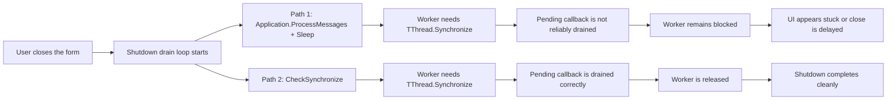

# `CheckSynchronize` vs `ProcessMessages` in Delphi FMX

A field guide to one of the most subtle and painful threading problems in Delphi FMX — and why the habit of "loop with `Application.ProcessMessages`" that often works in VCL can become a silent deadlock-like stall in FMX, especially on mobile targets.

---

## TL;DR

If you are waiting for background-thread completion from the UI thread and your code looks like this:

```delphi
while not Done do
begin
  Application.ProcessMessages;
  TThread.Sleep(15);
end;
```

**Do not rely on this pattern in FMX.** Use this instead:

```delphi
while not Done do
  CheckSynchronize(10);
```

`Application.ProcessMessages` in FMX is not a reliable shutdown-drain mechanism for `TThread.Synchronize` / `Queue` callbacks across platforms. If your worker thread is waiting on `Synchronize`, your loop may keep spinning while the worker stays blocked, and the UI may appear frozen or "stuck finishing up".

`CheckSynchronize` is the RTL function explicitly intended for draining that callback queue. Use it.

---

## Table of contents

- [The problem in one sentence](#the-problem-in-one-sentence)
- [Why this is worse than it sounds](#why-this-is-worse-than-it-sounds)
- [The VCL habit that breaks in FMX](#the-vcl-habit-that-breaks-in-fmx)
- [What `Synchronize` actually does under the hood](#what-synchronize-actually-does-under-the-hood)
- [Why `CheckSynchronize` is the correct tool](#why-checksynchronize-is-the-correct-tool)
- [But the docs say it's automatic — what gives?](#but-the-docs-say-its-automatic--what-gives)
- [Diagnostic signatures of the bug](#diagnostic-signatures-of-the-bug)
- [Platform-by-platform behavior](#platform-by-platform-behavior)
- [Checklist: when should I use what?](#checklist-when-should-i-use-what)
- [A real case from this project](#a-real-case-from-this-project)
- [Further reading](#further-reading)

---

## The problem in one sentence

In FMX, `Application.ProcessMessages` should not be relied on to drain the `TThread.Synchronize` queue. If you use it to wait on a worker thread that calls `Synchronize`, you can deadlock.

That's it. Every other section in this document exists to explain *why*, *where*, and *how to tell if it's happening to you*.

---

## Why this is worse than it sounds

Three things combine to make this one of the nastiest FMX bugs to diagnose:

**1. It looks like it should work.**
The same code pattern often works in VCL. Developers who have written Delphi code for years "know" that `ProcessMessages + Sleep` is how you wait for a thread from the main thread. In FMX, that habit becomes a trap.

**2. It sometimes works anyway.**
On Windows FMX the behavior is inconsistent. Sometimes `ProcessMessages` does drain `Synchronize`, depending on timing, version, and what else is in the message queue. You can ship a demo that works on your dev machine and fails silently on a user's Android device.

**3. The symptom is indistinguishable from a slow operation.**
From the user's perspective, "form takes 15 seconds to close" looks exactly like "form is doing something slow". Nothing in the failure mode clearly tells you it's a threading bug, so you can easily end up optimizing the wrong thing.

The correct diagnosis usually takes instrumentation (see [Diagnostic signatures](#diagnostic-signatures-of-the-bug) below).

---

## The VCL habit that breaks in FMX

Generations of Delphi developers learned this pattern:

```delphi
// Wait for a thread to finish — VCL style
while not Done do
begin
  Application.ProcessMessages;
  Sleep(15);
end;
```

This often works in **VCL** because of how the VCL message loop and RTL synchronization integrate on Windows. In practice, `TThread.Synchronize`, when called from a worker thread, is serviced through the application's normal message processing path, so `Application.ProcessMessages` can appear to "help" by letting that path run.

So in VCL, calling `ProcessMessages` can end up draining `Synchronize` work as a side effect.

**You should not assume that same side effect exists in FMX.** FMX is cross-platform and its message pump differs by platform and framework integration.

What matters in practice is this:

- `Application.ProcessMessages` is documented as processing the application's message queue.
- `CheckSynchronize` is the RTL API intended to drain pending `Synchronize` / `Queue` callbacks.
- In FMX, relying on `ProcessMessages` as if it were a `Synchronize` drain is not a safe assumption.

The result can be exactly the failure described in this document: your worker thread calls `Synchronize(SomeCallback)` and blocks, while the main thread spins in a loop that looks busy but does not reliably execute the pending callback. The two threads then wait on each other.

---

## What `Synchronize` actually does under the hood

To understand the fix, you need to know how `TThread.Synchronize` works internally. The worker thread's call breaks down into five steps:

1. The worker **enqueues** the callback procedure into an RTL-internal queue.
2. The worker **signals** an event indicating "there's work in the queue".
3. The worker **blocks** on another event, waiting for the callback to be executed and acknowledged.
4. Some time later, the main thread executes the callback in its own context.
5. The main thread signals completion, unblocking the worker.

The critical step is step 4. **Who triggers it?**

From the point of view of this document, the most important answer is practical rather than internal: if your main thread never calls the mechanism that drains pending `Synchronize` / `Queue` callbacks, the worker remains blocked waiting for the callback to run.

That is exactly why a drain loop based on `CheckSynchronize(...)` is reliable here, while a loop based on `Application.ProcessMessages` is not something you should trust in FMX.

---

## Why `CheckSynchronize` is the correct tool

`CheckSynchronize` is the RTL API whose sole responsibility is to drain the `Synchronize` and `Queue` callback queues. Its signature is:

```delphi
function CheckSynchronize(Timeout: Integer = 0): Boolean;
```

When you call `CheckSynchronize(10)`:

1. It checks if any callbacks are pending in the queue.
2. If yes, it executes **all** of them in FIFO order, on the current thread (which must be the main thread).
3. If no, it waits up to 10ms for new callbacks to arrive.
4. If a callback arrives during the wait, it is executed immediately (no need to wait the full 10ms).

Replacing `ProcessMessages + Sleep(15)` with `CheckSynchronize(10)` in the drain loop:

- Drains the right queue (Synchronize/Queue, not the OS message queue).
- Is more efficient: wakes up immediately when a callback arrives, rather than sleeping a fixed interval.
- Uses the RTL API intended to drain the `Synchronize` / `Queue` callback queue.
- Avoids relying on platform-specific or framework-specific side effects of message pumping.

**Note:** `CheckSynchronize` must be called from the main thread. That's normally where you want it anyway — you're trying to drain callbacks that need to execute on the main thread.

---

## But the docs say it's automatic — what gives?

If you read the official Embarcadero documentation for `CheckSynchronize`, you will find this statement:

> *"It is not necessary to call CheckSynchronize in a GUI application. The call to CheckSynchronize is made automatically by the application object."*

Read in isolation, this seems to contradict everything this document recommends. It does not — but the nuance matters.

The official statement is true **for the normal UI lifecycle**: while the application is running its main loop, processing input, dispatching events, and rendering frames, the framework periodically calls `CheckSynchronize` for you. You don't need to think about it. `Synchronize` and `Queue` callbacks just work.

The statement stops being true the moment **you take over the main thread with a custom loop**. The classic case is a shutdown drain:

```delphi
while not AllReleased do
begin
  // ... your wait logic ...
end;
```

While the main thread is inside this loop, it is not running the framework's normal event-processing path anymore. Whatever was draining `Synchronize` "automatically" is no longer happening, because the loop you wrote has the main thread. If a worker calls `Synchronize` during this window, its callback will sit in the queue forever — unless your loop drains it explicitly.

That is the entire point of using `CheckSynchronize` here: **you are temporarily replacing the framework's normal drain with your own**, and you need to drain the right queue.

So the documentation is not wrong. It is describing the steady-state behavior. This document is describing the transitional moments — shutdown, modal-style waits, anything that holds the main thread — where the steady-state guarantee no longer applies.

---

## Visual flow

The difference is not the waiting loop itself, but **which mechanism is responsible for draining pending synchronized callbacks**.



The key point is simple: the worker is not blocked because it is still doing useful work. It is blocked because it is waiting for a synchronized callback to run on the main thread. If the shutdown loop does not drain that callback queue correctly, the worker cannot finish, and the form appears to hang during closure.

---

## Diagnostic signatures of the bug

When this bug hits, it often has the following signatures. If you observe **two or more** of them together, a `Synchronize` drain problem is a very strong suspect:

### Signature 1 — The timeout is exactly your configured value

If your drain loop has a 15-second timeout and the form close takes exactly 15 seconds, that is not a slow operation. Slow operations have variable duration. A fixed timeout-duration delay is the signature of a deadlock-like stall that only resolves when the timeout fires.

### Signature 2 — Partial lifecycle callbacks run

If some UI-thread callbacks fire (e.g., `OnCancel`) but later ones do not (e.g., `OnTerminate`), you may be seeing the moment when the main thread stopped draining `Synchronize`. The earlier callbacks ran because the main thread was still processing events normally. Once it entered the drain loop, subsequent `Synchronize` calls started piling up undrained.

### Signature 3 — Visible UI elements don't update

Spinners that keep spinning after shutdown starts, labels that don't change, progress bars that don't reset — these are all side effects of UI-updating callbacks being stuck in the `Synchronize` queue. If finalization code that updates UI never seems to run, check whether it's being invoked via `Synchronize` and whether the drain is using the right API.

### Signature 4 — Works on Windows, fails on Android/iOS

If the same code works on Windows desktop but hangs on mobile, that is a strong warning sign. In practice, Windows FMX may appear to work because of timing or implementation details, while mobile targets expose the problem much more clearly.

---

## Platform-by-platform behavior

A practical summary that is safer to rely on:

| Platform / Framework | Can you rely on `Application.ProcessMessages` to drain `Synchronize`? | Can you rely on `CheckSynchronize` for that purpose? |
|---|---|---|
| VCL / Windows | Often yes in practice, but not the point of this document | Yes |
| FMX / any target | No — do not rely on it for this purpose | Yes |

The important recommendation is simple: in FMX, always use `CheckSynchronize` in drain loops that are meant to release pending `Synchronize` / `Queue` callbacks.

---

## Checklist: when should I use what?

Use this as a quick reference:

**Use `CheckSynchronize(timeout)` when:**
- You are on the main thread and need to drain callbacks posted by worker threads via `Synchronize` or `Queue`.
- You need to wait for a background task to finish and run its termination callbacks.
- You are writing a bounded shutdown drain that must allow workers to complete cleanly.

**Use `Application.ProcessMessages` when:**
- You are on the main thread and need to allow the UI to process animations, redraws, and input during a long main-thread operation.
- You are **not** waiting on a worker thread. You are just being polite to the UI.

**Use neither — use proper waiting primitives instead — when:**
- You can wait on a `TEvent` that the worker signals on termination (this is what SafeThread4D's `CancelAndWait` does internally).
- You are not on the main thread (calling `CheckSynchronize` from a worker thread is not useful; calling `ProcessMessages` from a worker thread is a bug).

**Never combine `ProcessMessages` + `Sleep` in a drain loop.**
That's the antipattern this document exists to warn against.

---

## A real case from this project

This document exists because the problem it describes affected the `BulkData` demo of SafeThread4D during development.

The demo originally used the classic pattern:

```delphi
procedure TFormMain.DrainUntilReleased(const TimeoutMs: Integer);
begin
  StartTick := TThread.GetTickCount64;
  while not AllReleased do
  begin
    Application.ProcessMessages;
    TThread.Sleep(15);

    if (TimeoutMs > 0) and (TThread.GetTickCount64 - StartTick >= UInt64(TimeoutMs)) then
      Break;
  end;
end;
```

On form close, the symptoms were:

- Form took exactly 15 seconds to close (= `DRAIN_TIMEOUT_MS`, signature 1).
- Log showed `[Cancel] Insert operation canceled by user` but **not** `[Terminate] Elapsed Time: ...` (signature 2).
- `TAniIndicator` continued animating after close was initiated (signature 3).
- Behavior was identical on Windows and Android (stronger on Android; signature 4).

The diagnostic session followed this reasoning:

1. The worker's `OnCancel` ran, which proved cancellation propagated correctly through `TSafeThread4D.CheckCancel` — so the mechanism itself was sound.
2. The worker's `OnTerminate` never ran, which is what zeros `FInsertRecordsParams` and makes `AllReleased` return `True` — so the main thread was blocking the worker's final `Synchronize` call.
3. The main thread was inside `DrainUntilReleased`, running `ProcessMessages + Sleep`.

Conclusion: in this project, `ProcessMessages + Sleep` was not draining the pending `Synchronize` work needed to release the task cleanly. The 15-second "wait" was in fact a deadlock-like stall resolved only by the timeout.

The fix was a one-line change:

```delphi
procedure TFormMain.DrainUntilReleased(const TimeoutMs: Integer);
begin
  StartTick := TThread.GetTickCount64;
  while not AllReleased do
  begin
    CheckSynchronize(10);

    if (TimeoutMs > 0) and (TThread.GetTickCount64 - StartTick >= UInt64(TimeoutMs)) then
      Break;
  end;
end;
```

After the change, the form closes in milliseconds in the project scenarios that motivated this note. The `OnTerminate` callback executes, `FInsertRecordsParams` is zeroed, `AllReleased` returns `True`, and the drain exits before the next iteration. No timeout, no stuck animation, no waiting.

The `BulkData` demo in this repository uses the corrected version, with a comment in `DrainUntilReleased` explaining why `ProcessMessages` is intentionally not used there. The same pattern is applied consistently across all SafeThread4D example units that perform a bounded shutdown drain.

---

## Further reading

- Official RTL documentation for `CheckSynchronize`: [Embarcadero DocWiki — System.Classes.CheckSynchronize](https://docwiki.embarcadero.com/Libraries/Alexandria/en/System.Classes.CheckSynchronize).
- Official RTL documentation for `TThread.Synchronize`: [Embarcadero DocWiki — System.Classes.TThread.Synchronize](https://docwiki.embarcadero.com/Libraries/Alexandria/en/System.Classes.TThread.Synchronize).
- Embarcadero blog posts and community QC entries about FMX threading from multiple Delphi versions. The guidance has shifted over releases; search for the version you are targeting.

---

## Closing note

This document exists because the correct answer to "how do I wait for a thread from the main thread in FMX?" is not the one most developers learned from VCL. The VCL habit is deeply ingrained and the FMX behavior is sparsely documented. The gap between the two has produced countless hours of debugging across the Delphi community.

If you are reading this because your FMX app is hanging on shutdown and you do not know why, `CheckSynchronize` is one of the first things worth testing.

If you are reading this because you are migrating VCL code to FMX and want to avoid the trap — bookmark this page. Every drain loop, every "wait for thread" pattern, and every `ProcessMessages + Sleep` combination in an FMX codebase deserves review.

And if you are reading this because you are curious — threading problems of this class are one of the reasons libraries like SafeThread4D exist in the first place. Explicit lifecycle, cooperative cancellation, and safe coordination primitives make these failures visible and fixable.

---

*This document is part of the SafeThread4D project documentation. See [README.md](../README.md) and [Architecture.md](./Architecture.md) for project-level information.*
